# 设计文档 — Phase 6 增强功能

## 概述

本设计文档描述 CaddyPanel Phase 6 的 6 个新功能和 i18n 翻译的技术实现方案。所有功能基于现有架构（Go Gin + GORM + React 19 + Radix UI）扩展，遵循项目既有的分层模式：Model → Service → Handler → Frontend。

### 功能范围

| # | 功能 | 后端变更 | 前端变更 | 数据模型变更 |
|---|------|---------|---------|-------------|
| 1 | 站点一键克隆 | 新增 Clone API | Clone 弹窗 | 无（复用 Host） |
| 2 | DNS 解析检查 | 新增 DNS Check API | 状态图标 + 自动检查 | 无 |
| 3 | 响应式移动端适配 | 无 | CSS 媒体查询 + 汉堡菜单 | 无 |
| 4 | 2FA TOTP 认证 | TOTP 生成/验证 API | QR 码 + 验证码输入 | User 表扩展 |
| 5 | 站点分组与标签 | Group/Tag CRUD + 批量操作 | 筛选器 + 标签展示 | 新增 Group/Tag/HostTag 表 |
| 6 | 站点模板 | Template CRUD + 导入导出 | 模板管理页 | 新增 Template 表 |
| 7 | i18n 翻译 | 错误码键名化 | en.json/zh.json 扩展 | 无 |

### 设计原则

1. **最小侵入**：尽量扩展现有结构，不重构已有代码
2. **一致性**：新 API 遵循现有 RESTful 风格，新组件遵循 Radix UI Themes 设计语言
3. **`*bool` 指针**：所有新增布尔字段继续使用 `*bool`（GORM 零值陷阱）
4. **审计日志**：所有增删改操作通过 `h.audit()` 记录
5. **i18n 优先**：所有新增 UI 文本使用 `t()` 函数，不硬编码

## 架构

### 系统架构图

```mermaid
graph TB
    subgraph Frontend["前端 (React 19 + Radix UI)"]
        HostList["HostList.jsx<br/>+ 克隆/DNS/分组/标签"]
        Layout["Layout.jsx<br/>+ 汉堡菜单"]
        Login["Login.jsx<br/>+ 2FA 验证码"]
        Templates["Templates.jsx<br/>新页面"]
        Dashboard["Dashboard.jsx<br/>+ 响应式"]
        Settings["Settings.jsx<br/>+ 2FA 设置"]
    end

    subgraph API["后端 API (Gin)"]
        HostH["host handler<br/>+ Clone"]
        DNSH["dns_check handler<br/>新"]
        AuthH["auth handler<br/>+ 2FA"]
        GroupH["group handler<br/>新"]
        TagH["tag handler<br/>新"]
        TplH["template handler<br/>新"]
    end

    subgraph Service["业务逻辑层"]
        HostSvc["host service<br/>+ CloneHost"]
        DNSSvc["dns_check service<br/>新"]
        TOTPSvc["totp service<br/>新"]
        GroupSvc["group service<br/>新"]
        TplSvc["template service<br/>新"]
    end

    subgraph DB["SQLite (GORM)"]
        Users["users<br/>+ totp_secret<br/>+ recovery_codes"]
        Hosts["hosts<br/>+ group_id"]
        Groups["groups 新"]
        Tags["tags 新"]
        HostTags["host_tags 新"]
        Tpls["templates 新"]
    end

    Frontend --> API
    API --> Service
    Service --> DB
```



### 新增路由规划

```
POST   /api/hosts/:id/clone          → 站点克隆
GET    /api/dns-check?domain=xxx     → DNS 解析检查

POST   /api/auth/2fa/setup           → 生成 TOTP 密钥
POST   /api/auth/2fa/verify          → 验证并启用 2FA
POST   /api/auth/2fa/disable         → 禁用 2FA

GET    /api/groups                    → 分组列表
POST   /api/groups                    → 创建分组
PUT    /api/groups/:id                → 更新分组
DELETE /api/groups/:id                → 删除分组
POST   /api/groups/:id/batch-enable   → 批量启用
POST   /api/groups/:id/batch-disable  → 批量禁用

GET    /api/tags                      → 标签列表
POST   /api/tags                      → 创建标签
PUT    /api/tags/:id                  → 更新标签
DELETE /api/tags/:id                  → 删除标签

GET    /api/templates                 → 模板列表
POST   /api/templates                 → 创建模板
PUT    /api/templates/:id             → 更新模板
DELETE /api/templates/:id             → 删除模板
POST   /api/templates/import          → 导入模板
GET    /api/templates/:id/export      → 导出模板
POST   /api/templates/:id/create-host → 从模板创建 Host
```

所有新路由注册在 `main.go` 的 `protected` 路由组下（需 JWT 认证）。DNS 检查也需认证，因为它依赖 Settings 中的服务器 IP。


## 组件与接口

### 1. 站点克隆（需求 1）

**后端**：

- `internal/service/host.go` 新增 `CloneHost(sourceID uint, newDomain string) (*model.Host, error)`
  - 通过事务（`db.Transaction`）确保原子性
  - 深拷贝主表所有字段（排除 ID、Domain、CreatedAt、UpdatedAt）
  - 深拷贝子表：upstreams、custom_headers、access_rules、basic_auths、routes
  - 子表记录清零 ID 和 HostID，GORM 自动关联新 Host
  - 域名唯一性检查复用现有逻辑
  - 克隆完成后调用 `ApplyConfig()`

- `internal/handler/host.go` 新增 `Clone(c *gin.Context)`
  - 请求体：`{ "domain": "new.example.com" }`
  - 审计日志：action="CLONE", detail="Cloned host 'old.com' → 'new.com'"

**前端**：

- `HostList.jsx` 每行新增克隆按钮（Copy 图标）
- 点击弹出 `CloneDialog`：显示源域名（只读）+ 新域名输入框
- 调用 `hostAPI.clone(id, { domain })` → 刷新列表

### 2. DNS 解析检查（需求 2）

**后端**：

- `internal/service/dns_check.go` 新增 `DnsCheckService`
  - `Check(domain string) (*DnsCheckResult, error)`
  - 使用 Go 标准库 `net.LookupHost()` 和 `net.LookupIP()` 查询 A/AAAA 记录
  - 从 Settings 表读取 `server_ipv4` 和 `server_ipv6`
  - 比对逻辑：
    - 两者均为空 → 返回 `records_only` 状态 + DNS 记录
    - A 记录包含 server_ipv4 或 AAAA 包含 server_ipv6 → `matched`
    - 有记录但不匹配 → `mismatched` + 实际 IP 列表
    - 查询失败或无记录 → `no_record` + 错误信息

- `internal/handler/dns_check.go` 新增 `DnsCheckHandler`
  - `GET /api/dns-check?domain=xxx`
  - 返回：`{ "status": "matched|mismatched|no_record|records_only", "a_records": [...], "aaaa_records": [...], "expected_ipv4": "...", "expected_ipv6": "..." }`

**前端**：

- `HostList.jsx` 每行域名旁显示 DNS 状态图标
  - 绿色圆点 = matched，黄色 = mismatched，灰色 = no_record/未检查
  - 鼠标悬停 Tooltip 显示详细 IP 信息
- `HostFormDialog` 域名输入框 onChange 防抖 800ms 自动触发 DNS 检查
- `web/src/api/index.js` 新增 `dnsCheckAPI.check(domain)`

### 3. 响应式移动端适配（需求 3）

**纯前端变更，无后端改动。**

- `Layout.jsx` 改造：
  - 新增 `isMobile` 状态（`window.matchMedia('(max-width: 767px)')`）
  - 移动端：Sidebar 默认隐藏，顶部显示 Hamburger 按钮
  - 点击 Hamburger → Sidebar 以 overlay 形式从左滑入（CSS transition）
  - 点击导航链接 → 自动收起 Sidebar
  - 桌面端（≥768px）：恢复固定 Sidebar 布局

- `Dashboard.jsx`：统计卡片 Grid `columns` 已使用 Radix 响应式 `{ initial: '1', sm: '2', md: '4' }`，无需大改，确认 `initial: '1'` 在移动端生效即可。

- `HostList.jsx`：
  - 移动端切换为卡片视图（Card 列表替代 Table）
  - 每张卡片显示域名、类型、状态、操作按钮

- `Settings.jsx`：表单布局在移动端切换为全宽单列

- CSS 变更：
  - 在 `web/src/index.css` 添加 `@media (max-width: 767px)` 断点样式
  - Sidebar overlay 的 z-index、backdrop、transition 动画

### 4. 2FA TOTP 认证（需求 4）

**后端**：

- Go 依赖：`github.com/pquerna/otp` (TOTP 库)

- `model.User` 扩展字段：
  - `TOTPSecret string` — 加密存储的 TOTP 密钥（AES-GCM，密钥为 JWT_SECRET 派生）
  - `TOTPEnabled *bool` — 是否已启用 2FA
  - `RecoveryCodes string` — JSON 数组，每个元素为 `{ "code_hash": "bcrypt...", "used": false }`

- `internal/service/totp.go` 新增 `TOTPService`：
  - `GenerateSecret(userID uint) (secret, otpauthURI string, error)` — 生成密钥，暂存到 User.TOTPSecret（但 TOTPEnabled 仍为 false）
  - `VerifyAndEnable(userID uint, code string) (recoveryCodes []string, error)` — 验证 TOTP 码，启用 2FA，生成 8 个恢复码
  - `Disable(userID uint, code string) error` — 验证 TOTP 码后禁用 2FA
  - `ValidateLogin(userID uint, code string) (bool, error)` — 登录时验证 TOTP 码或恢复码

- `internal/handler/auth.go` 修改：
  - `Login()` 流程变更：
    1. 验证用户名密码（不变）
    2. 检查 `user.TOTPEnabled`
    3. 如果启用 2FA 且请求中无 `totp_code` → 返回 `{ "requires_2fa": true, "temp_token": "..." }`
    4. 如果有 `totp_code` → 验证后签发正式 JWT
  - 新增 `Setup2FA()`, `Verify2FA()`, `Disable2FA()` 端点

- `temp_token` 设计：短期 JWT（5 分钟），claims 中标记 `pending_2fa: true`，不能访问其他 API

**前端**：

- `Login.jsx` 改造：
  - 登录返回 `requires_2fa` 时，显示 TOTP 验证码输入界面
  - 6 位数字输入框 + "使用恢复码" 链接
  - 恢复码输入：8 位字母数字输入框

- `Settings.jsx` 新增 2FA 设置区域：
  - "启用 2FA" 按钮 → 调用 setup API → 显示 QR 码（使用 `qrcode.react` 库）
  - 用户扫码后输入验证码确认 → 显示 8 个恢复码（一次性展示，提示保存）
  - "禁用 2FA" 按钮 → 输入当前 TOTP 码确认

### 5. 站点分组与标签（需求 5）

**后端**：

- 新增模型（`internal/model/model.go`）：

```go
type Group struct {
    ID        uint      `gorm:"primaryKey" json:"id"`
    Name      string    `gorm:"uniqueIndex;not null;size:64" json:"name"`
    Color     string    `gorm:"size:16" json:"color"` // hex color e.g. "#10b981"
    CreatedAt time.Time `json:"created_at"`
    UpdatedAt time.Time `json:"updated_at"`
}

type Tag struct {
    ID        uint      `gorm:"primaryKey" json:"id"`
    Name      string    `gorm:"uniqueIndex;not null;size:64" json:"name"`
    Color     string    `gorm:"size:16" json:"color"`
    CreatedAt time.Time `json:"created_at"`
    UpdatedAt time.Time `json:"updated_at"`
}

type HostTag struct {
    HostID uint `gorm:"primaryKey" json:"host_id"`
    TagID  uint `gorm:"primaryKey" json:"tag_id"`
}
```

- `model.Host` 扩展：
  - `GroupID *uint` — FK to Group（一对多）
  - `Group *Group` — GORM 关联（Preload 用）
  - `Tags []Tag` — 多对多关联 `gorm:"many2many:host_tags"`

- `internal/service/group.go` — Group CRUD + 批量启用/禁用
- `internal/service/tag.go` — Tag CRUD
- `internal/handler/group.go` — Group API 端点
- `internal/handler/tag.go` — Tag API 端点

- Host 列表 API 扩展：
  - `GET /api/hosts?group_id=1&tag_id=2` 支持筛选
  - `service.List()` 增加可选的 `group_id` 和 `tag_id` 过滤参数

- Host 创建/更新 API 扩展：
  - `HostCreateRequest` 新增 `GroupID *uint` 和 `TagIDs []uint`
  - 更新时同步 `host_tags` 关联表

- 批量操作：
  - `POST /api/groups/:id/batch-enable` — 将组内所有 Host 的 enabled 设为 true + ApplyConfig
  - `POST /api/groups/:id/batch-disable` — 同上设为 false

- 删除 Group 时：如果有关联 Host，将这些 Host 的 `group_id` 设为 NULL

**前端**：

- `HostList.jsx` 改造：
  - 表格上方新增 Group 下拉筛选 + Tag 多选筛选
  - 每行显示 Group 名称（Badge）和 Tag 列表（小 Badge）
  - Host 编辑弹窗新增 Group 选择器和 Tag 多选器

- Group/Tag 管理：在 Settings 页面或独立弹窗中提供 CRUD 界面
  - 简单的列表 + 新增/编辑/删除
  - 颜色选择器（预设颜色列表）

### 6. 站点模板（需求 6）

**后端**：

- 新增模型：

```go
type Template struct {
    ID          uint      `gorm:"primaryKey" json:"id"`
    Name        string    `gorm:"not null;size:128" json:"name"`
    Description string    `gorm:"size:512" json:"description"`
    Type        string    `gorm:"not null;size:16;default:custom" json:"type"` // "preset" or "custom"
    Config      string    `gorm:"type:text;not null" json:"config"` // JSON snapshot
    CreatedAt   time.Time `json:"created_at"`
    UpdatedAt   time.Time `json:"updated_at"`
}
```

- `Config` JSON 结构（TemplateConfig）：

```go
type TemplateConfig struct {
    HostType        string           `json:"host_type"`
    TLSMode         string           `json:"tls_mode"`
    Compression     *bool            `json:"compression"`
    CorsEnabled     *bool            `json:"cors_enabled"`
    // ... 所有 Host 主表配置字段（排除 ID、Domain、GroupID、CreatedAt、UpdatedAt）
    Upstreams       []UpstreamInput  `json:"upstreams"`
    CustomHeaders   []HeaderInput    `json:"custom_headers"`
    AccessRules     []AccessInput    `json:"access_rules"`
    BasicAuths      []BasicAuthInput `json:"basic_auths"`
}
```

- `internal/service/template.go`：
  - `SaveAsTemplate(hostID uint, name, desc string) (*Template, error)` — 从 Host 快照
  - `CreateFromTemplate(templateID uint, domain string) (*Host, error)` — 反序列化创建
  - `Export(templateID uint) ([]byte, error)` — JSON 序列化
  - `Import(jsonData []byte) (*Template, error)` — 解析 + 验证 + 保存
  - `SeedPresets()` — 数据库初始化时创建 6 个预设模板

- 6 个预设模板：
  1. **WordPress 反代** — proxy 类型，单 upstream localhost:8080，compression 开启
  2. **SPA 静态站** — static 类型，try_files 配置 index.html
  3. **API 反向代理** — proxy 类型，CORS 开启，security_headers 开启
  4. **PHP-FPM 站点** — php 类型，fastcgi localhost:9000
  5. **静态文件下载站** — static 类型，directory_browse 开启
  6. **WebSocket 应用** — proxy 类型，websocket 开启

- 预设模板在 `database.Init()` 中通过 `SeedPresets()` 创建，`type="preset"` 的模板不可删除/修改

**前端**：

- 新增 `web/src/pages/Templates.jsx` 页面
  - 模板列表（卡片视图），区分 preset 和 custom
  - 创建/编辑/删除 custom 模板
  - 导入（文件上传）/ 导出（JSON 下载）
  - "从模板创建 Host" 按钮 → 弹窗输入域名

- `HostList.jsx` Host 编辑弹窗新增 "保存为模板" 按钮
- `App.jsx` 新增 `/templates` 路由
- `Layout.jsx` 侧边栏新增 "模板" 导航项

### 7. i18n 翻译（需求 7）

- 所有新增 UI 文本在 `en.json` 和 `zh.json` 中添加对应键值对
- 新增翻译命名空间：
  - `clone.*` — 克隆相关
  - `dns_check.*` — DNS 检查相关
  - `twofa.*` — 2FA 相关
  - `group.*` — 分组相关
  - `tag.*` — 标签相关
  - `template.*` — 模板相关
  - `mobile.*` — 移动端相关（如汉堡菜单 aria-label）

- 后端错误信息键名化：
  - 现有错误信息如 `"domain 'xxx' already exists"` 改为返回 `{ "error_key": "error.domain_exists", "error_params": { "domain": "xxx" } }`
  - 前端根据 `error_key` 查找翻译，fallback 到 `error` 字段的原始英文消息
  - 为保持向后兼容，同时返回 `error`（英文）和 `error_key`（翻译键）

- 预设模板名称和描述使用翻译键（如 `template.preset.wordpress.name`），前端根据当前语言动态展示


## 数据模型

### 数据模型变更总览

```mermaid
erDiagram
    User {
        uint id PK
        string username UK
        string password
        string role
        string totp_secret "新增: AES加密的TOTP密钥"
        bool totp_enabled "新增: 是否启用2FA"
        string recovery_codes "新增: JSON恢复码数组"
    }

    Host {
        uint id PK
        string domain UK
        string host_type
        uint group_id FK "新增: 分组ID"
    }

    Group {
        uint id PK
        string name UK "新增表"
        string color
    }

    Tag {
        uint id PK
        string name UK "新增表"
        string color
    }

    HostTag {
        uint host_id PK_FK "新增关联表"
        uint tag_id PK_FK
    }

    Template {
        uint id PK
        string name "新增表"
        string description
        string type "preset|custom"
        text config "JSON快照"
    }

    Group ||--o{ Host : "一对多"
    Host }o--o{ Tag : "多对多"
    Host }o--o{ HostTag : ""
    Tag }o--o{ HostTag : ""
```

### 新增表详细定义

#### groups 表

| 字段 | 类型 | 约束 | 说明 |
|------|------|------|------|
| id | uint | PK, auto-increment | |
| name | varchar(64) | UNIQUE, NOT NULL | 分组名称 |
| color | varchar(16) | | 颜色值，如 "#10b981" |
| created_at | datetime | | |
| updated_at | datetime | | |

#### tags 表

| 字段 | 类型 | 约束 | 说明 |
|------|------|------|------|
| id | uint | PK, auto-increment | |
| name | varchar(64) | UNIQUE, NOT NULL | 标签名称 |
| color | varchar(16) | | 颜色值 |
| created_at | datetime | | |
| updated_at | datetime | | |

#### host_tags 表（关联表）

| 字段 | 类型 | 约束 | 说明 |
|------|------|------|------|
| host_id | uint | PK, FK → hosts.id | |
| tag_id | uint | PK, FK → tags.id | |

#### templates 表

| 字段 | 类型 | 约束 | 说明 |
|------|------|------|------|
| id | uint | PK, auto-increment | |
| name | varchar(128) | NOT NULL | 模板名称 |
| description | varchar(512) | | 模板描述 |
| type | varchar(16) | NOT NULL, default "custom" | "preset" 或 "custom" |
| config | text | NOT NULL | Host 配置 JSON 快照 |
| created_at | datetime | | |
| updated_at | datetime | | |

#### users 表扩展字段

| 字段 | 类型 | 约束 | 说明 |
|------|------|------|------|
| totp_secret | varchar(512) | | AES-GCM 加密的 TOTP 密钥 |
| totp_enabled | bool* | default false | 是否启用 2FA |
| recovery_codes | text | | JSON: `[{"hash":"bcrypt...","used":false}, ...]` |

### GORM 自动迁移

所有新表和字段通过 GORM `AutoMigrate` 在应用启动时自动创建，无需手动 SQL 迁移：

```go
db.AutoMigrate(&model.Group{}, &model.Tag{}, &model.HostTag{}, &model.Template{})
// User 和 Host 的新字段也会自动添加
```

### 模板配置 JSON 快照格式

```json
{
    "host_type": "proxy",
    "tls_mode": "auto",
    "tls_enabled": true,
    "http_redirect": true,
    "websocket": false,
    "compression": true,
    "cors_enabled": false,
    "cors_origins": "",
    "cors_methods": "",
    "cors_headers": "",
    "security_headers": false,
    "error_page_path": "",
    "cache_enabled": false,
    "cache_ttl": 300,
    "root_path": "",
    "directory_browse": false,
    "php_fastcgi": "",
    "index_files": "",
    "custom_directives": "",
    "redirect_url": "",
    "redirect_code": 301,
    "upstreams": [{"address": "localhost:8080", "weight": 1}],
    "custom_headers": [],
    "access_rules": [],
    "basic_auths": []
}
```

导出的模板 JSON 文件格式：

```json
{
    "version": "1.0",
    "exported_at": "2026-03-01T12:00:00Z",
    "template": {
        "name": "My Template",
        "description": "...",
        "type": "custom",
        "config": { ... }
    }
}
```


## 正确性属性（Correctness Properties）

*属性（Property）是指在系统所有有效执行中都应成立的特征或行为——本质上是对系统应做什么的形式化陈述。属性是人类可读规范与机器可验证正确性保证之间的桥梁。*

### Property 1: 克隆产生等价 Host

*For any* Host（包含任意组合的主表字段和子表数据：upstreams、custom_headers、access_rules、basic_auths、routes），克隆操作应产生一个新 Host，其所有配置字段（除 ID、Domain、CreatedAt、UpdatedAt 外）与原 Host 相同，且所有子表记录数量和内容（除 ID、HostID 外）与原 Host 一致。

**Validates: Requirements 1.2, 1.3**

### Property 2: 克隆产生独立记录

*For any* 克隆操作，新 Host 的 ID 必须与原 Host 不同，且新 Host 的所有子表记录的 host_id 必须指向新 Host 的 ID，而非原 Host 的 ID。

**Validates: Requirements 1.4**

### Property 3: DNS 状态判定正确性

*For any* 域名的 A/AAAA 记录集合和服务器 IP 配置（server_ipv4、server_ipv6），DNS 检查应返回正确的状态：当 A 记录包含 server_ipv4 或 AAAA 记录包含 server_ipv6 时返回 "matched"；当有记录但均不匹配时返回 "mismatched"（并附带实际 IP 列表）；当两个服务器 IP 均为空时返回 "records_only"。

**Validates: Requirements 2.2, 2.3, 2.4, 2.8**

### Property 4: TOTP 生成与验证 round-trip

*For any* 用户，生成 TOTP 密钥后，使用该密钥按 RFC 6238 算法计算出的当前验证码应能通过验证接口的校验。

**Validates: Requirements 4.1, 4.3**

### Property 5: 恢复码生成格式与数量

*For any* 2FA 启用操作，应生成恰好 8 个恢复码，每个恢复码为 8 位字母数字组合，且存储的 bcrypt 哈希应能与对应明文匹配。

**Validates: Requirements 4.4**

### Property 6: 登录流程依赖 2FA 状态

*For any* 用户，若 2FA 已启用，则仅凭用户名密码登录应返回 `requires_2fa` 而非签发 JWT；若 2FA 未启用，则用户名密码正确即可获得 JWT。

**Validates: Requirements 4.5, 4.10**

### Property 7: 恢复码一次性使用

*For any* 有效的恢复码，首次使用应允许登录并将该码标记为已使用；再次使用同一恢复码应被拒绝。

**Validates: Requirements 4.6**

### Property 8: 无效验证码拒绝登录

*For any* 随机生成的非法字符串（既非当前有效 TOTP 码，也非未使用的恢复码），在 2FA 验证步骤中应被拒绝。

**Validates: Requirements 4.7**

### Property 9: 2FA 禁用 round-trip

*For any* 已启用 2FA 的用户，提供有效 TOTP 码禁用 2FA 后，该用户的登录流程应恢复为仅需用户名密码（不再要求 TOTP）。

**Validates: Requirements 4.8**

### Property 10: Group/Tag CRUD round-trip

*For any* 有效的 Group 或 Tag（名称 + 颜色），创建后查询应返回相同数据；更新后查询应返回更新后的数据；删除后查询应返回不存在。

**Validates: Requirements 5.1, 5.2**

### Property 11: Host 分组关联

*For any* Host 和 *any* Group，将 Host 分配到该 Group 后，查询该 Host 应返回正确的 Group 信息；将 Host 的 group_id 设为空后，Host 不再属于任何 Group。

**Validates: Requirements 5.3**

### Property 12: Host 标签关联

*For any* Host 和 *any* 标签集合，为 Host 分配这些标签后，查询该 Host 应返回完全相同的标签集合。

**Validates: Requirements 5.4**

### Property 13: Host 筛选正确性

*For any* 包含多个 Host（分属不同 Group 和 Tag）的数据集，按 Group 筛选应仅返回属于该 Group 的 Host；按 Tag 筛选应仅返回包含该 Tag 的 Host；同时按 Group 和 Tag 筛选应仅返回同时满足两个条件的 Host。

**Validates: Requirements 5.5, 5.6, 5.7**

### Property 14: 批量启用/禁用

*For any* Group 及其关联的 Host 集合，执行批量禁用后所有 Host 的 enabled 应为 false；执行批量启用后所有 Host 的 enabled 应为 true。

**Validates: Requirements 5.9, 5.10**

### Property 15: 删除 Group 解除关联

*For any* 关联有 Host 的 Group，删除该 Group 后，原关联 Host 应仍然存在且其 group_id 应为 NULL。

**Validates: Requirements 5.12**

### Property 16: Host-Template-Host round-trip

*For any* Host（包含子表数据），将其保存为模板后再从该模板创建新 Host，新 Host 的所有配置字段（除 ID、Domain 外）和子表数据应与原 Host 等价。

**Validates: Requirements 6.2, 6.4**

### Property 17: 模板导出导入 round-trip

*For any* 有效的 Template 配置快照 JSON，导出为 JSON 文件后再导入，应产生等价的 Template 记录（name、description、config 内容一致）。

**Validates: Requirements 6.11**

### Property 18: 预设模板不可变

*For any* type="preset" 的模板，删除和更新操作应被拒绝并返回错误。

**Validates: Requirements 6.9**

### Property 19: 无效模板 JSON 拒绝导入

*For any* 格式无效的 JSON 字符串（语法错误、缺少必要字段如 host_type），模板导入应返回错误并拒绝创建。

**Validates: Requirements 6.7**

### Property 20: 变更操作产生审计日志

*For any* 成功的增删改操作（克隆 Host、启用/禁用 2FA、Group/Tag CRUD、Template CRUD/导入导出），操作完成后审计日志表中应新增一条对应的记录。

**Validates: Requirements 1.6, 4.9, 5.11, 6.10**

### Property 21: 后端错误响应包含翻译键

*For any* Phase 6 新增 API 返回的错误响应，响应体中应包含 `error_key` 字段，其值为可用于前端 i18n 翻译的键名。

**Validates: Requirements 7.5**


## 错误处理

### 后端错误处理策略

所有 Phase 6 新增 API 遵循统一的错误响应格式：

```json
{
    "error": "Human-readable English message",
    "error_key": "error.domain_exists",
    "error_params": { "domain": "example.com" }
}
```

| 场景 | HTTP 状态码 | error_key | 说明 |
|------|------------|-----------|------|
| 克隆域名重复 | 400 | `error.domain_exists` | 域名已存在 |
| 克隆源 Host 不存在 | 404 | `error.host_not_found` | Host ID 无效 |
| DNS 查询失败 | 200 | — | 返回 `status: "no_record"` + error 信息 |
| TOTP 验证码无效 | 401 | `error.invalid_totp` | 验证码错误 |
| 恢复码已使用 | 401 | `error.recovery_code_used` | 恢复码已被使用 |
| 2FA 未启用时尝试禁用 | 400 | `error.2fa_not_enabled` | 2FA 未启用 |
| Group 名称重复 | 400 | `error.group_name_exists` | 分组名已存在 |
| Tag 名称重复 | 400 | `error.tag_name_exists` | 标签名已存在 |
| 删除预设模板 | 403 | `error.preset_immutable` | 预设模板不可修改 |
| 模板 JSON 格式无效 | 400 | `error.invalid_template_json` | JSON 解析失败 |
| 模板缺少必要字段 | 400 | `error.template_missing_fields` | 缺少 host_type 等 |
| temp_token 过期 | 401 | `error.temp_token_expired` | 2FA 临时令牌过期 |

### 前端错误处理

- API 错误响应优先使用 `error_key` 查找翻译，fallback 到 `error` 字段
- 网络错误显示通用 "连接失败" 提示
- 2FA 验证失败后清空输入框，允许重试
- 克隆/模板操作失败后保持弹窗打开，显示错误信息

### 事务与数据一致性

- 克隆操作使用 GORM `db.Transaction()` 确保原子性
- 批量启用/禁用使用事务确保所有 Host 状态一致更新
- 模板导入使用事务，解析失败时回滚
- 2FA 启用流程：先暂存密钥（TOTPEnabled=false），验证通过后才设为 true

## 测试策略

### 双重测试方法

本项目采用单元测试 + 属性测试的双重策略：

- **单元测试**：验证具体示例、边界情况和错误条件
- **属性测试**：验证跨所有输入的通用属性

两者互补，缺一不可。

### 属性测试配置

- **Go 后端**：使用 `github.com/leanovate/gopter` 属性测试库
- **每个属性测试最少运行 100 次迭代**
- **每个属性测试必须以注释引用设计文档中的属性编号**
- 注释格式：`// Feature: phase6-enhancements, Property {N}: {property_text}`

### 测试范围

#### 后端单元测试

| 模块 | 测试重点 |
|------|---------|
| `service/host.go` CloneHost | 克隆完整性、域名重复拒绝、事务回滚 |
| `service/dns_check.go` | DNS 状态判定、无服务器 IP 时的行为、查询失败处理 |
| `service/totp.go` | TOTP 生成/验证、恢复码生成/使用/重复使用拒绝 |
| `service/group.go` | CRUD、批量操作、删除解除关联 |
| `service/tag.go` | CRUD、多对多关联 |
| `service/template.go` | CRUD、保存/创建 round-trip、导入导出 round-trip、预设不可变 |
| `handler/auth.go` | 2FA 登录流程、temp_token 机制 |

#### 后端属性测试

| Property # | 测试文件 | 说明 |
|-----------|---------|------|
| 1, 2 | `service/host_clone_test.go` | 克隆等价性和独立性 |
| 3 | `service/dns_check_test.go` | DNS 状态判定 |
| 4, 5, 6, 7, 8, 9 | `service/totp_test.go` | TOTP 全流程 |
| 10, 11, 12, 13, 14, 15 | `service/group_tag_test.go` | 分组标签全流程 |
| 16, 17, 18, 19 | `service/template_test.go` | 模板全流程 |
| 20 | `handler/audit_test.go` | 审计日志覆盖 |
| 21 | `handler/error_response_test.go` | 错误响应格式 |

#### 前端测试

前端以手动测试为主，重点验证：
- 响应式布局在 768px 断点的切换行为
- 2FA QR 码显示和验证码输入流程
- 克隆弹窗交互
- DNS 状态图标显示
- 分组/标签筛选器交互
- 模板管理页面 CRUD
- i18n 翻译完整性（中英文切换）

### 边界情况测试

| 场景 | 预期行为 |
|------|---------|
| 克隆没有子表数据的 Host | 成功，新 Host 也没有子表数据 |
| DNS 查询超时 | 返回 no_record + 超时错误信息 |
| 服务器 IP 均为空时 DNS 检查 | 返回 records_only + DNS 记录 |
| 恢复码全部用完 | 只能使用 TOTP 码登录 |
| 删除空 Group（无关联 Host） | 直接删除，无需特殊处理 |
| 导入超大模板 JSON | 验证 JSON 大小限制（建议 1MB） |
| 预设模板名称的 i18n | 前端根据翻译键动态展示，不依赖数据库中的 name 字段 |

